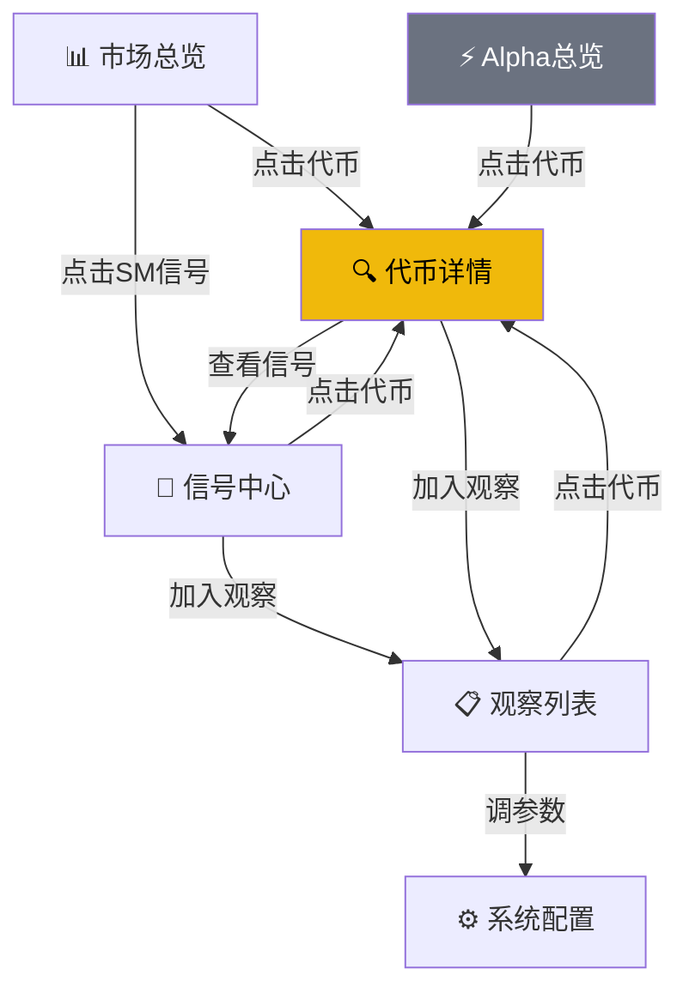

# P3 方案：MEME多维信号攻坚（更新版）

> **方向决策**：暂停 Alpha 相关开发，全力攻坚 MEME 信号管道
> **核心目标**：接入全部相关 API → 构建6维评分 → 前端精简聚焦
> **更新日期**：2026-03-16

---

## 一、执行状态总览

| Step | 内容 | 状态 | 遗留 |
|------|------|------|------|
| Step 1 | 前端重构 9→6页 | ✅ 完成 | 4项遗留 |
| Step 2 | 新增采集器+Schema | ✅ 完成 | 无 |
| Step 2.5 | 修补遗留+前端P3对接 | ⏳ 待执行 | — |
| Step 3 | 信号引擎 4维→6维 | ⏳ 待执行 | — |
| Step 4 | 代币详情页+页面互联 | ⏳ 待执行 | — |

---

## 二、已完成：前端重构 (Step 1)

```
现有6页 (5路由 + 3区侧边栏)
┌──────────────────────┐
│  M   MEME Signal     │
├──────────────────────┤
│  MEME 信号            │
│ 📊  市场总览          │  Dashboard.tsx
│ 🎯  信号中心          │  SignalCenter.tsx (SM信号+趋势图+AI话题)
│ 📋  观察列表          │  Watchlist.tsx
├──────────────────────┤
│  Alpha (暂停开发)     │
│ ⚡  Alpha 总览        │  AlphaOverview.tsx (列表+匹配合一)
├──────────────────────┤
│  系统                 │
│ ⚙️  系统配置          │  SystemConfig.tsx (策略+采集器合一)
└──────────────────────┘
```

### Step 1 遗留问题 (Step 2.5 解决)

1. **6个死文件未删** — `Alpha.tsx`, `Config.tsx`, `History.tsx`, `Matches.tsx`, `Signals.tsx`, `Tokens.tsx`, `Strategy.tsx`
2. **Dashboard 仍显示 Alpha 内容** — Alpha 新上线滚动条、匹配结果卡片应移除或弱化
3. **Dashboard 缺筛选** — 无链筛选(BSC/SOL)、无周期切换(5m/1h/4h)
4. **SystemConfig 只展示4维权重** — 后端已6维，前端缺 KOL + 热度 输入框

---

## 三、已完成：新采集器 + Schema (Step 2)

### 3个新采集器

| 采集器 | 文件 | Cron | 验证 |
|--------|------|------|------|
| Token Dynamic Data | `token-dynamic.ts` | */5 * * * * (按需) | ✅ 端点正常 |
| Meme Exclusive Rank | `meme-exclusive.ts` | 0 */4 * * * | ✅ 50个代币 |
| Top Traders (PnL Rank) | `top-traders.ts` | 0 */6 * * * | ✅ 25个交易员 |
| Top Search | 复用 `unified-rank.ts` | 0 * * * * | ✅ 已配置 |

### 3个新数据库表

- `token_dynamics` — 实时多窗口数据（volume5m/1h/4h, 买卖拆分, KOL/SM持仓）
- `top_traders` — PnL排行（address, winRate, topEarningTokens）
- `meme_exclusive_rank` — Pulse算法评分（score, volumeBn, impression）

### 3个新API端点

- `GET /api/dynamics` + `GET /api/dynamics/:chainId/:address`
- `GET /api/traders`
- `GET /api/meme-exclusive`

### 策略6维权重已扩展

`signal_strategy_config` 新增 `weightKol` + `weightHype` 字段

---

## 四、待执行：Step 2.5 修补

### 任务清单

- [ ] 删除6个死页面文件
- [ ] `api.ts` 新增P3前端API函数：
  - `fetchDynamics()`, `fetchTokenDynamic(chainId, address)`
  - `fetchTraders(chainId, period)`
  - `fetchMemeExclusive(chainId)`
- [ ] `SystemConfig.tsx` 权重从4维升级到6维：
  - 新增 KOL/KOL 和 热度 两个输入框
  - wSum 校验改为 `Sm+Social+Trend+Inflow+Kol+Hype = 100`
- [ ] `Dashboard.tsx` 改造：
  - 移除或弱化 Alpha 新上线滚动条
  - 移除匹配结果卡片（已移至 AlphaOverview）
  - 新增链筛选 (BSC / SOL / All)
  - 新增 Meme Exclusive Top5 卡片
  - Trending表格可按链筛选

---

## 五、待执行：Step 3 信号引擎 4维→6维

### 信号评分架构

```
6维评分 → 加权求和 → 负面扣分 → 最终状态

维度1  SM    = (SM信号数*20 + 净流入排名*15 + SM持仓变化*15)  / 50 → 归一化百分
维度2  社交  = (Social Hype排名 + Topic关联)
维度3  趋势  = (K线技术 + 多窗口涨幅 + 高低突破)
维度4  流入  = (Volume增长 + 买卖比 + KYC增长)
维度5  鲸鱼  = (KOL持仓 + Pro持仓 + 高胜率交易员买入)  ← P3新增
维度6  热度  = (Top Search + Meme Exclusive score + 曝光)  ← P3新增
```

### 修改文件

- `signal-evaluator.ts` — 新增 `calcKolScore()` 和 `calcHypeScore()`
- 读取 `token_dynamics` 获取 KOL/SM 持仓占比
- 读取 `top_traders.topEarningTokensJson` 交叉验证
- 读取 `meme_exclusive_rank.score` 获取 Pulse 评分
- `token_watchlist` 扩展 `kolScore` + `hypeScore` 字段

---

## 六、待执行：Step 4 代币详情页+互联

### 代币详情页设计

```
┌─────────────────────────────────────────────────┐
│ 🔍 $SYMBOL  BSC  价格 $0.0123  ▲15.3% (1h)     │
│     市值 $2.5M  流动性 $800K  FDV $3.1M         │
├─────────────────────────────────────────────────┤
│ [K线图 5m|1h|4h 切换]                           │
├──────────┬──────────┬───────────────────────────┤
│ 📊 交易数据          │ 👥 持仓分布               │
│ Vol 5m: $85K        │ 总持有: 12,345            │
│ 买/卖比: 1.3        │ KOL: 5 (1.2%)            │
│ 笔数: 买1200/卖800  │ SM: 3 (0.5%)             │
├──────────┴──────────┴───────────────────────────┤
│ 🎯 信号评分        总分: 78.5 🟢 buy_signal     │
│ SM: 82  社交: 65  趋势: 71  流入: 80            │
│ 鲸鱼: 90  热度: 45                              │
├─────────────────────────────────────────────────┤
│ Pulse评分: 85/100  曝光: 2,340次                │
│ 审计: 低风险  社交: X✓ TG✓ Web✓                  │
└─────────────────────────────────────────────────┘
```

### 页面互联



### 新增文件

- `TokenDetail.tsx` — 全维数据聚合页
- `App.tsx` 新增路由 `/token/:chainId/:address`
- 各页面代币名称改为 `<Link>` 跳转

---

## 七、执行优先级

| 序号 | 步骤 | 工作量 | 说明 |
|------|------|--------|------|
| **1** | Step 2.5 修补 | 1h | 清理死文件 + Dashboard改造 + api.ts + 6维权重 |
| **2** | Step 3 信号引擎6维 | 2h | signal-evaluator 新增2维 + watchlist扩展 |
| **3** | Step 4 代币详情页 | 3h | TokenDetail + 页面互联 |

## 八、已完成数据表汇总

| 状态 | 表 | 用途 |
|------|----|------|
| ✅ 已有 | tokens, token_snapshots | Trending代币 |
| ✅ 已有 | smart_money_signals, smart_money_inflow | SM信号 |
| ✅ 已有 | alpha_tokens, match_results | Alpha |
| ✅ 已有 | social_hype_entries | 社交热度 |
| ✅ 已有 | meme_rush_tokens | Meme Rush |
| ✅ 已有 | topic_rushes | AI话题 |
| ✅ 已有 | token_watchlist | 观察列表+评分 |
| ✅ 已有 | token_klines | K线 |
| ✅ 已有 | token_audits | 安全审计 |
| ✅ 已有 | signal_strategy_config | 策略A/B (6维) |
| ✅ P3新 | **token_dynamics** | 实时多窗口数据 |
| ✅ P3新 | **top_traders** | PnL排行 |
| ✅ P3新 | **meme_exclusive_rank** | Pulse算法评分 |
