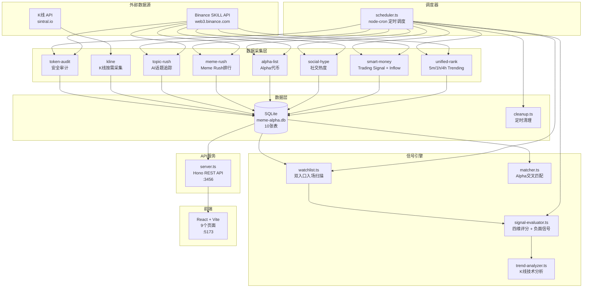
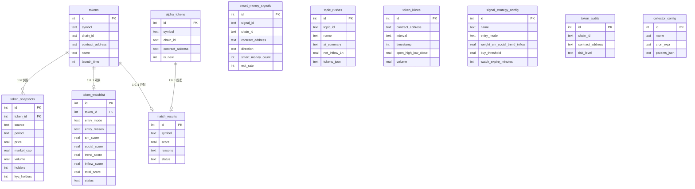
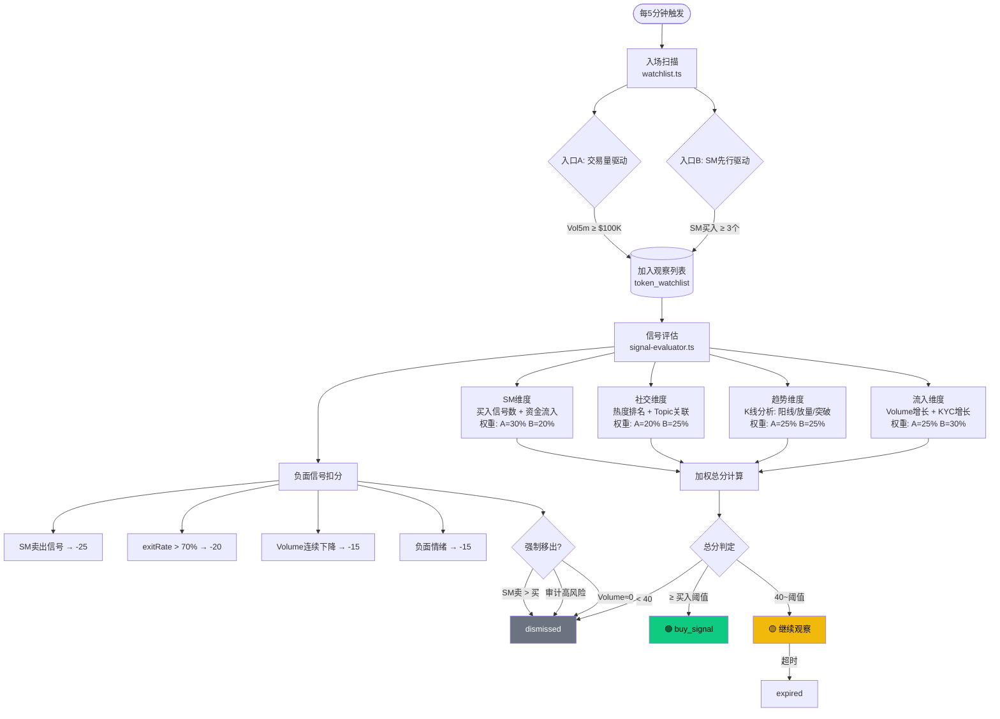
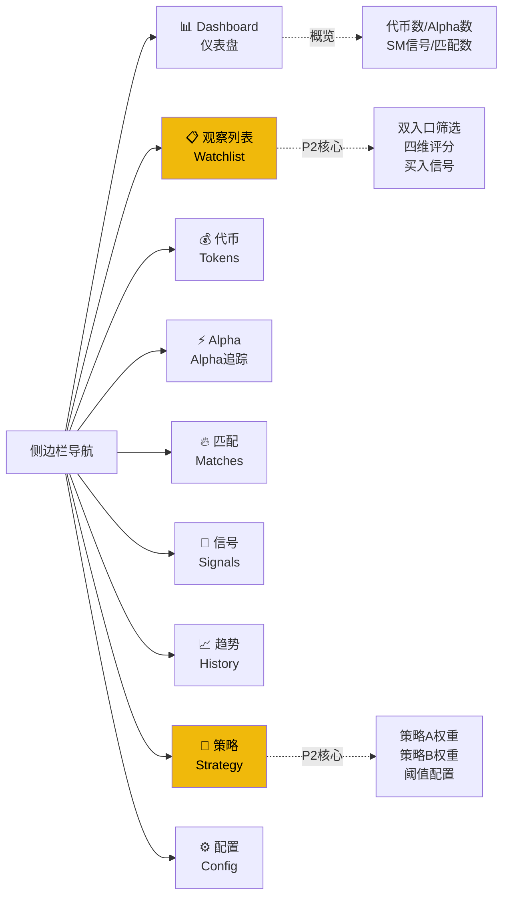
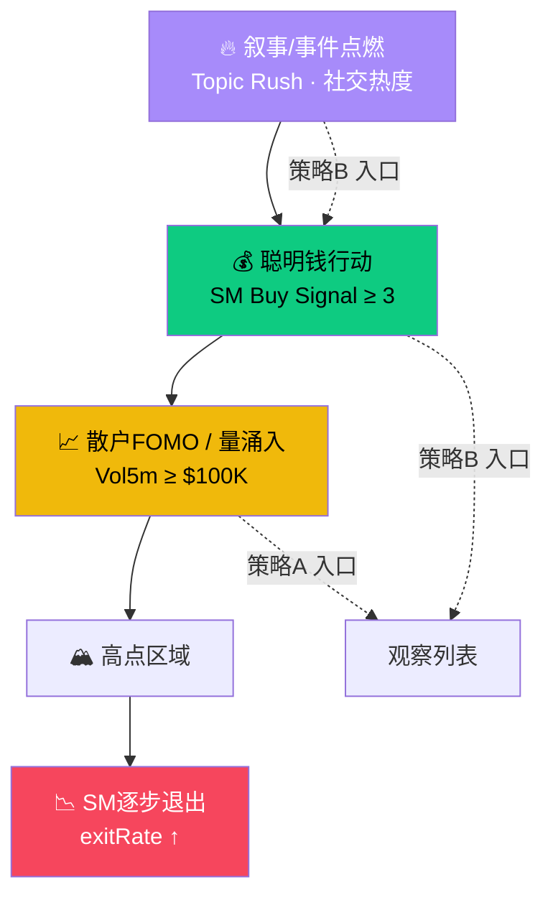

# MEME Alpha Dashboard — 产品使用手册 & 架构总览

> 版本: v2.0 (P2 Signal Pipeline)
> 更新时间: 2026-03-16

---

## 一、产品定位

MEME Alpha Dashboard 是一套 **MEME代币数据监控 + 信号交易管道** 系统，核心功能：

1. **数据采集层** — 自动从 Binance SKILL API 采集 9 类链上数据
2. **Alpha匹配层** — 监控新上 Binance Alpha 的代币并与热门数据交叉匹配
3. **信号管道层** — 双入口(量驱动/SM先行)自动筛选 → 四维评分 → 买入信号输出

---

## 二、系统架构总览



---

## 三、目录结构

```
binanceskill/
├── src/
│   ├── server.ts              # Hono API 服务 (端口3456)
│   ├── scheduler.ts           # Cron 调度器 (17个任务)
│   ├── collectors/            # 数据采集器 (9个)
│   │   ├── base.ts            #   HTTP工具 (httpPost/httpGet/log)
│   │   ├── unified-rank.ts    #   Trending排行 (5m/1h/4h)
│   │   ├── smart-money.ts     #   SM信号 + 资金流入
│   │   ├── social-hype.ts     #   社交热度
│   │   ├── alpha-list.ts      #   Binance Alpha代币列表
│   │   ├── meme-rush.ts       #   Meme Rush排行
│   │   ├── topic-rush.ts      #   AI话题追踪
│   │   ├── kline.ts           #   K线数据 (按需)
│   │   └── token-audit.ts     #   代币安全审计
│   ├── engine/                # 信号引擎 (4个)
│   │   ├── watchlist.ts       #   双入口入场扫描
│   │   ├── signal-evaluator.ts#   四维评分引擎
│   │   ├── trend-analyzer.ts  #   K线技术分析
│   │   └── matcher.ts         #   Alpha交叉匹配
│   └── db/
│       ├── index.ts           #   SQLite连接
│       ├── schema.ts          #   Drizzle ORM 10张表
│       ├── seed.ts            #   默认配置种子
│       └── cleanup.ts         #   数据清理
├── web/                       # React前端
│   └── src/
│       ├── App.tsx            #   路由 + 侧边栏
│       ├── api.ts             #   API调用封装
│       ├── index.css          #   全局样式
│       └── pages/             #   9个页面
│           ├── Dashboard.tsx  #     仪表盘
│           ├── Watchlist.tsx  #     观察列表 (P2新增)
│           ├── Tokens.tsx     #     代币列表
│           ├── Alpha.tsx      #     Alpha追踪
│           ├── Matches.tsx    #     匹配结果
│           ├── Signals.tsx    #     SM信号
│           ├── History.tsx    #     趋势历史
│           ├── Strategy.tsx   #     策略A/B配置 (P2新增)
│           └── Config.tsx     #     采集器配置
├── data/
│   └── meme-alpha.db          # SQLite数据库
├── drizzle.config.ts          # Drizzle迁移配置
└── package.json
```

---

## 四、数据库 ER 关系



---

## 五、信号管道流程 (核心)



---

## 六、采集调度表

```mermaid
gantt
    title 采集任务调度 (基于 Cron)
    dateFormat HH:mm
    axisFormat %H:%M

    section 5分钟级
    trending_bsc_5m       :active, t1, 00:00, 5min
    trending_sol_5m       :active, t2, 00:00, 5min
    watchlist_entry扫描   :crit, t3, 00:00, 5min
    signal_evaluate评估   :crit, t4, 00:00, 5min

    section 30分钟级
    topic_rush_latest     :t5, 00:00, 30min

    section 1小时级
    trending_bsc_1h       :t6, 00:00, 60min
    trending_sol_1h       :t7, 00:00, 60min
    trading_signal        :t8, 00:00, 60min
    alpha_token_list      :t9, 00:00, 60min
    topic_rush_viral      :t10, 00:00, 60min

    section 4小时级
    trending_bsc_4h       :t11, 00:00, 240min
    trending_sol_4h       :t12, 00:00, 240min
    smart_money_inflow    :t13, 00:00, 240min
    social_hype           :t14, 00:00, 240min
    meme_rush_bsc         :t15, 00:00, 240min
    meme_rush_sol         :t16, 00:00, 240min

    section 每日
    data_cleanup          :t17, 03:00, 30min
```



| 任务 | Cron | 说明 |
|------|------|------|
| `trending_bsc_5m` | `*/5 * * * *` | BSC 5分钟热门 |
| `trending_sol_5m` | `*/5 * * * *` | SOL 5分钟热门 |
| `watchlist_entry` | `*/5 * * * *` | 双入口入场扫描 |
| `signal_evaluate` | `*/5 * * * *` | 四维信号评估 |
| `topic_rush_latest` | `*/30 * * * *` | AI话题(最新) |
| `trending_bsc_1h` | `0 * * * *` | BSC小时热门 |
| `trending_sol_1h` | `0 * * * *` | SOL小时热门 |
| `trading_signal` | `0 * * * *` | SM交易信号 |
| `alpha_token_list` | `0 * * * *` | Alpha列表 |
| `topic_rush_viral` | `0 * * * *` | AI话题(爆款) |
| `trending_bsc_4h` | `0 */4 * * *` | BSC 4小时热门 |
| `trending_sol_4h` | `0 */4 * * *` | SOL 4小时热门 |
| `smart_money_inflow` | `0 */4 * * *` | SM资金流入排行 |
| `social_hype` | `0 */4 * * *` | 社交热度 |
| `meme_rush_bsc` | `0 */4 * * *` | BSC Meme Rush |
| `meme_rush_sol` | `0 */4 * * *` | SOL Meme Rush |
| `data_cleanup` | `0 3 * * *` | 删除过期数据 |

---

## 七、API 端点速查

### 基础数据

| 端点 | 方法 | 说明 |
|------|------|------|
| `/api/health` | GET | 健康检查 |
| `/api/stats` | GET | 全局统计(代币数/快照数等) |
| `/api/tokens` | GET | 代币列表 `?chainId=&limit=&offset=` |
| `/api/tokens/:id/history` | GET | 代币历史快照 |
| `/api/alpha` | GET | Alpha代币列表 |
| `/api/alpha/new` | GET | 新Alpha代币 |
| `/api/signals` | GET | SM信号列表 |
| `/api/matches` | GET | 匹配结果 `?status=&limit=` |
| `/api/matches/run` | POST | 手动触发匹配引擎 |
| `/api/matches/:id/status` | PUT | 更新匹配状态 |

### P2 信号管道

| 端点 | 方法 | 说明 |
|------|------|------|
| `/api/watchlist` | GET | 观察列表 + 统计 `?status=&entryMode=` |
| `/api/watchlist/:id` | PUT | 更新观察状态 |
| `/api/watchlist/scan` | POST | 手动触发入场扫描 |
| `/api/watchlist/evaluate` | POST | 手动触发信号评估 |
| `/api/topics` | GET | Topic Rush话题列表 |
| `/api/strategy` | GET | 策略A/B配置 |
| `/api/strategy/:name` | PUT | 更新策略参数 |
| `/api/klines/:chainId/:address` | GET | K线数据 `?interval=` |

### 管理

| 端点 | 方法 | 说明 |
|------|------|------|
| `/api/config` | GET | 采集器配置列表 |
| `/api/config/:name` | PUT | 更新采集器配置 |
| `/api/collector/run/:name` | POST | 手动运行单个采集器 |
| `/api/collector/run-all` | POST | 运行所有采集器 |

---

## 八、前端页面导航



### 页面功能说明

| 页面 | 功能 |
|------|------|
| **Dashboard** | 全局概览：代币数、Alpha数、SM信号、匹配数、Trending表格、SM信号流 |
| **📋 观察列表** | ⭐ P2核心：四维评分、入口筛选、买入信号标记、手动扫描/评估 |
| **代币** | 全部代币列表，可按链筛选，显示最新快照数据 |
| **Alpha** | 追踪 Binance Alpha 上架代币及新发现 |
| **匹配** | Alpha与Trending代币的交叉匹配结果及评分 |
| **信号** | Smart Money 买入/卖出/流入信号明细 |
| **趋势** | 代币历史快照趋势图 |
| **🧪 策略** | ⭐ P2核心：策略A/B权重、阈值、超时的可视化配置 |
| **配置** | 采集器开关、Cron表达式、参数配置 |

---

## 九、快速启动

```bash
# 1. 安装依赖
npm install
cd web && npm install && cd ..

# 2. 推送数据库 schema
npx drizzle-kit push

# 3. 启动后端 (终端1)
npm run dev
# → http://localhost:3456

# 4. 启动前端 (终端2)
cd web && npm run dev
# → http://localhost:5173

# 5. 首次采集数据
curl -X POST http://localhost:3456/api/collector/run-all

# 6. 手动触发信号管道
curl -X POST http://localhost:3456/api/watchlist/scan
curl -X POST http://localhost:3456/api/watchlist/evaluate
```

---

## 十、数据清理策略

| 数据表 | 保留时间 | 说明 |
|--------|----------|------|
| `token_snapshots` | 7天 | 5min/1h/4h快照 |
| `token_klines` (5min) | 3天 | 5分钟K线 |
| `token_klines` (其他) | 7天 | 1h/4h K线 |
| `smart_money_signals` | 30天 | SM信号 |
| `token_watchlist` (expired/dismissed) | 30天 | 已过期/移出的观察 |
| `topic_rushes` | 14天 | AI话题 |

清理任务在每日凌晨3:00自动运行 (`cleanup.ts`)。

---

## 十一、技术栈

| 层 | 技术 |
|----|------|
| 后端框架 | Hono (轻量Web框架) |
| ORM | Drizzle ORM |
| 数据库 | SQLite (better-sqlite3) |
| 运行时 | Node.js + tsx (TypeScript执行) |
| 调度 | node-cron |
| 前端框架 | React 19 + Vite 8 |
| 路由 | react-router-dom v7 |
| 样式 | 原生CSS (暗色主题) |
| HTTP | Node.js https 模块 (无第三方依赖) |

---

## 十二、双入口策略对比

```mermaid
graph LR
    subgraph 策略A — 交易量驱动
        A1[Vol5m ≥ $100K] --> A2[加入观察]
        A2 --> A3[SM 30%<br/>社交 20%<br/>趋势 25%<br/>流入 25%]
        A3 --> A4[阈值 70<br/>超时 60min]
    end

    subgraph 策略B — SM先行驱动
        B1[SM买入 ≥ 3个] --> B2[加入观察]
        B2 --> B3[SM 20%<br/>社交 25%<br/>趋势 25%<br/>流入 30%]
        B3 --> B4[阈值 65<br/>超时 120min]
    end

    style A1 fill:#f0b90b,color:#000
    style B1 fill:#0ecb81,color:#000
```

| 维度 | 策略A (量驱动) | 策略B (SM先行) |
|------|---------------|---------------|
| **入场条件** | 5min交易量 ≥ $100K | SM买入信号 ≥ 3个 |
| **SM权重** | 30% | 20% |
| **社交权重** | 20% | 25% |
| **趋势权重** | 25% | 25% |
| **流入权重** | 25% | 30% |
| **买入阈值** | 70分 | 65分 |
| **观察超时** | 60分钟 | 120分钟 |
| **逻辑** | 量起 → 确认资金/SM跟进 | SM先行 → 等待量确认 |

---

## 十三、MEME上涨驱动模型



> **核心理念**: 策略B在SM阶段早期入场（更高风险/更高收益），策略A在FOMO阶段入场（更高确认性/更低收益）。两策略并行跑数据后对比优化。
